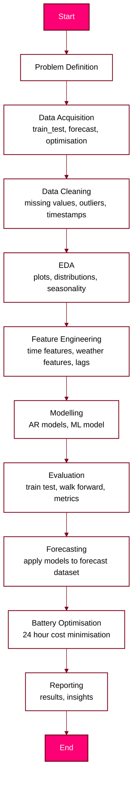

```mermaid
%%{init: {
  'theme': 'base',
  'themeVariables': {
    'primaryColor': '#FD0075',
    'primaryBorderColor': '#800020',
    'primaryTextColor': '#ffffff',
    'secondaryColor': '#F5F5F5',
    'secondaryBorderColor': '#800020',
    'tertiaryColor': '#ffffff',
    'tertiaryBorderColor': '#800020',
    'lineColor': '#800020',
    'fontFamily': 'Arial'
  }
}}%%

flowchart TD

    A[Start] --> B[Problem Definition]
    B --> C[Data Acquisition<br/>train_test, forecast, optimisation]

    C --> D[Data Cleaning<br/>missing values, outliers, timestamps]

    D --> E[EDA<br/>plots, distributions, seasonality]

    E --> F[Feature Engineering<br/>time features, weather features, lags]

    F --> G[Modelling<br/>AR models, ML model]

    G --> H[Evaluation<br/>train test, walk forward, metrics]

    H --> I[Forecasting<br/>apply models to forecast dataset]

    I --> J[Battery Optimisation<br/>24 hour cost minimisation]

    J --> K[Reporting<br/>results, insights]

    K --> L[End]

%% === Styling ===
    classDef primary fill:#FD0075,stroke:#800020,stroke-width:2px,color:#ffffff;
    classDef secondary fill:#ffffff,stroke:#800020,stroke-width:1.6px,color:#000;

    class A,L primary;
    class B,C,D,E,F,G,H,I,J,K secondary;

```